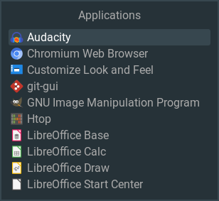
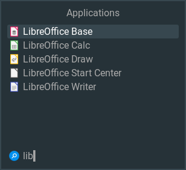

# awesome-launchbox
Rofi-like application and document launcher for the Awesome 4.x window manager.

Launchbox is a multi-purpose launcher with a minimal design and high performance which can be used as stand-alone wibox/popup or embedded into more complex parent widgets, e.g. dashboards.



The screenshot shows the launcher with default configuration.
Used theme font: _Roboto_, icons: _Papirus_, colors: _#263238_, _#37474F_, _#607D8B_.



The filter input field is only displayed during typing as an overlay at the last list position.

## Key bindings
- Use the cursor keys `Up` and `Down` for navigation and press `Enter` to launch the selected item.
- Press `Esc` to abort. This normally closes the window. You can also use your additional configured exit mod+key.
- `F5` updates/refreshes the list (and cache) if you have added or removed applications or documents.
- Just begin typing to start and continue filtering for item names, press `Backspace` to delete the last char from the input field.

## Features
- Multiple instances for different purposes/configurations.
- Can be used as embedded widget or stand-alone.
- Supports desktop applications, documents (via xdg-open) and terminal-based executables, with multiple include/exclude dirs and file extensions.
- Cache file for menu items to enable faster startup.
- In-memory caching of filter results.
- Icons can be disabled to improve performance and for the most-minimal look.
- Sizes are calculated automatically from the font size.
- Uses existing theme-variables for colors, borders and font.
- Live update of filter results during typing.
- Minimal redraws, only when really needed.

## Non-features
- No dynamic list update on addition/removal of applications or documents.
- No file/MIME-type based document icons.
- No application categories.
- No GUI-based configuration options.
- No mouse support.

# Installation
Copy the file `launchbox.lua` into the folder `.config/awesome` of your home directory and add the following line at the beginning of your `rc.lua` configuration file.

```lua
local launchbox = require("launchbox")
```

# Minimal configuration example
Create a Launchbox popup with default configuration by adding the following line somewhere in your `rc.lua` file. This will not create a awful.popup object as the function name would suggest, it's a just a normal wibox.

```lua
local my_launchbox_popup = launchbox("My Applications"):create_popup()
```

Add a key binding (in this example `Super+l`) to your existing `globalkeys` definition.

```lua
local globalkeys = gears.table.join(
    ...
    awful.key({"Mod4"}, "l", my_launchbox_popup.open, {description="Launchbox", group="launcher"}),
    ...
)
```

This should open a basic launcher popup similar (depending on your applications) to the screenshots above.

# Full configuration example
The following example shows the creation of a launcher widget object with all possible configuration options.

```lua
local my_launchbox_widget = launchbox("Example", {
    terminal = "urxvt",
        -- program to launch terminal-based applications, default: "xterm"
    disable_cache = false,
        -- disable file cache for menu items, true/false, default: false
    disable_apps = false,
        -- disable desktop applications, true/false, default: false
    disable_icons = false,
        -- true/false, default: false
    doc_dirs = { "documents/manuals", "documents/papers", "other", "-backup" },
        -- list of document dirs, use "-" to exclude sub dirs
        -- directories will be scanned recursively
    doc_ext = { "docx", "xlsx", "pdf" },
        -- list of file extensions, default: all
    bin_dirs = { "/usr/bin", "own_scripts" },
        -- list of terminal-based executable dirs, use "-" to exclude sub dirs
        -- directories will NOT be scanned recursively
    --bin_ext = nil,
        -- list of file extensions, default: all
    fg = "#AAAAAA",
        -- color, default: theme menubar_fg_normal or fg_normal
    bg = "#263238",
        -- color, default: theme menubar_bg_normal or bg_normal
    fg_focus = "#FFFFFF",
        -- color, default: theme menubar_fg_focus or fg_focus
    bg_focus = "#37474F",
        -- color, default: theme menubar_bg_focus or bg_focus
    font = "Roboto 12",
        -- default: theme font
    margin = 10,
        -- margin around the widget, default: 0
    --forced_width = 200,
        -- default: auto
    rows = 10,
        -- number of menu items to display, default: 10
    --forced_height = 400,
        -- if set, rows parameter is ignored, default: auto
    exit_mod = "Mod4", exit_key = "l"
        -- can be set to match globalkeys to implement toggling
})

```

Then we create a wibox/popup object for that widget with all possible configuration options.


```lua
local my_launchbox_popup = my_launchbox_widget:create_popup({
    border_width = 2,
        -- default: theme menubar_border_width or border_width or 0
    border_color = "#607D8B",
        -- color, default: theme menubar_border_color or border_normal
    position = "top_left",
        -- allowed values for awful.placement.align(), default: "centered"
    padding = 10
        -- distance from screen border, default: 0
})
```

You can then use the functions `open()`, `close()` or `toggle()` of the popup object in a key binding or button to control its visibility.

```lua
...
my_launchbox_popup.open()
...
```

You can create as many launcher widget objects as you want with their own individual configuration. For example only for documents or only for audio files. But don't forget to set `disable_apps = true` for launchers that should not display desktop applications.

## Embedding example

The next example shows how to use the launcher widget in a parent wibox. This is very similar to what is done in the `launchbox:create_popup()` function. We are re-using the my_launchbox_widget object from the example above.

```lua
local my_wibox = wibox({
    width   = my_launchbox_widget.width,
    height  = my_launchbox_widget.height,
    widget  = my_launchbox_widget,
    visible = false
})
```

Then we need a function to show the wibox and to start the launcher. The list initialization and the start are two separate functions, because in cases where the wibox should be permanently visible, you will need to initialize the list only once, but you may want to start and stop the launcher depending on "mouse::enter" and "mouse::leave" events. The start function has an optional parameter to specify a "done-callback" function that is called when the launcher is aborted or an item has been executed. In this example, we simply hide the wibox.

```lua
my_wibox.open = function()
    my_launchbox_widget:init_list()
    my_launchbox_widget:start( function() my_wibox.visible = false end )
    my_wibox.visible = true
end
```

We can also add a function to close the wibox and to stop the launcher. This is not really needed for this example, because the stop function is called internally by the launcher itself on abort or execution, and we specified a callback to hide the wibox. But the close function could be used to trigger the stop externally.

```lua
my_wibox.close = function()
    my_launchbox_widget:stop()
    my_wibox.visible = false
end
```

## Function overview
You have already seen most of the functions and their usage in the examples above, so here is just a short description.

`launchbox( name, args )`

Constructor for a new launchbox widget object. All sub-widgets are created here, and the list of items is created by scanning all directories or reading the cache file. So all time-consuming operations are done in the startup/initialization phase to allow fast access during runtime.
- **name (mandatory)**: unique name for the launcher, also used for the cache file name.
- **args (optional)**: table with configuration parameters.

`launchbox:init_list()`

As the name suggests, this function initializes the list of menu items to the default state, which shows all items in alphabetical order without filter and the selection cursor on the first item. If you don't want to reset the state everytime the launcher is shown, then you only need to call this function once during startup/initialization.

`launchbox:start( done_callback )`

Starts the keygrabber of the launcher. 
- **done_callback**: callback function that is called when the launcher is aborted or if an item has been executed. Can be used to perform additional actions, like hiding or unfocusing the parent widget.

`launchbox:stop()`

Stops the keygrabber of the launcher. This function is automatically called when the launcher is aborted or if an item has been executed. Does nothing if the launcher is already stopped, so it is safe to call it multiple times.

`launchbox:create_popup( args )`

Create a basic wibox/popup object for the launchbox widget object. You can use the functions `open()`, `close()` or `toggle()` to control the visibility.
- **args (optional)**: table with configuration parameters.
